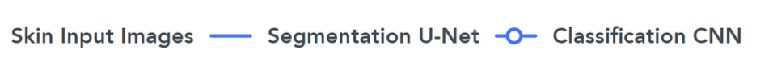
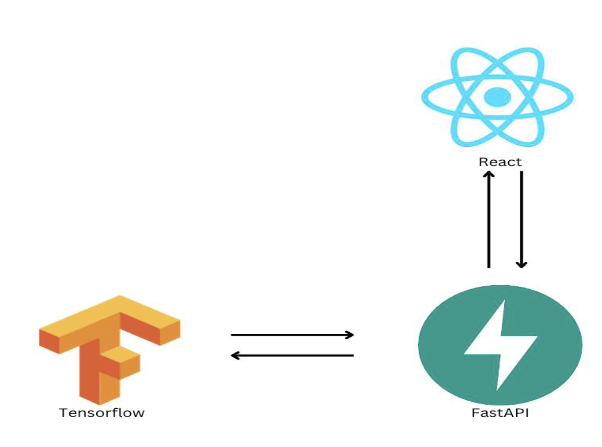
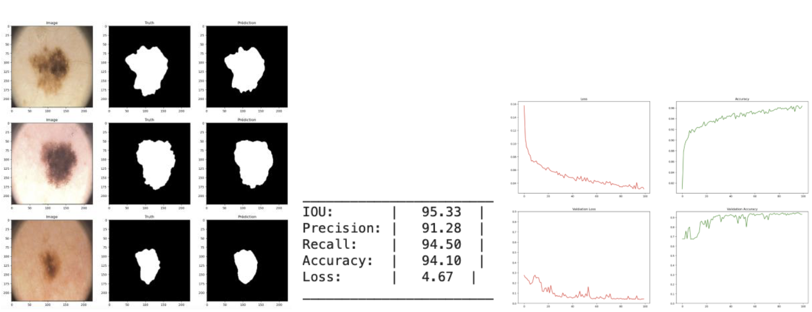
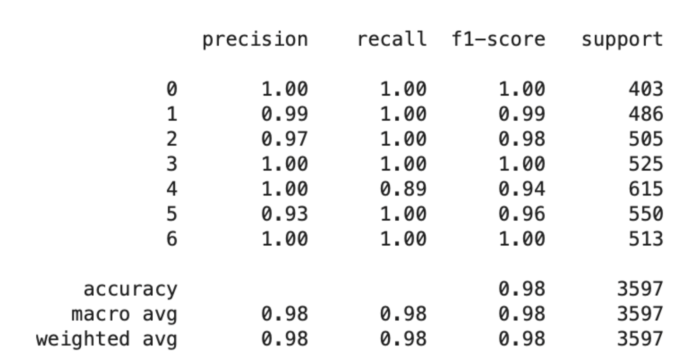
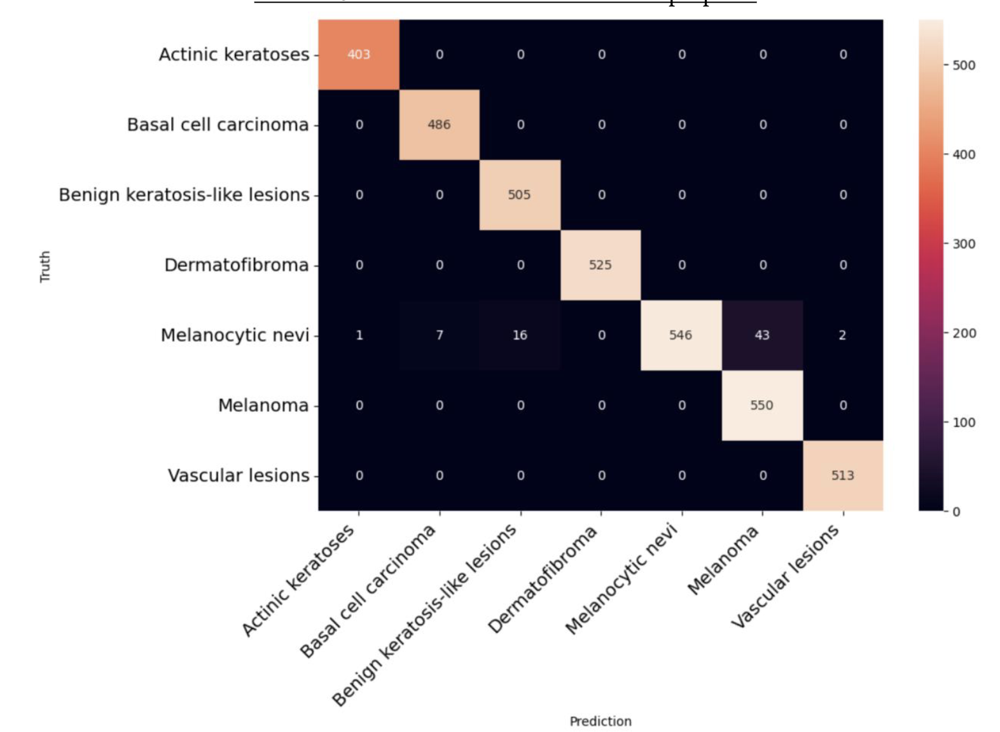
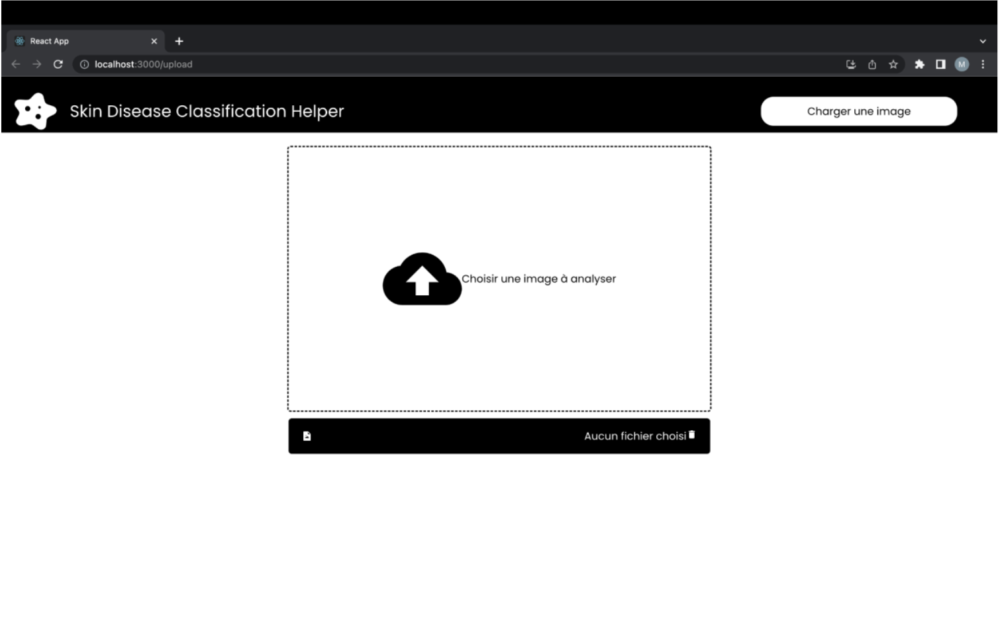
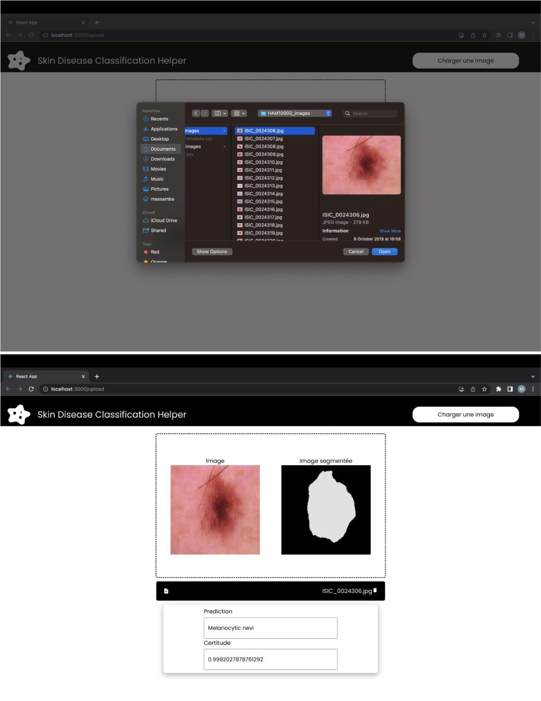

### Classification des maladies de la peau

La classification des troubles cutanés à l’aide d’une image est une tâche difficile qui repose fortement sur les caractéristiques des maladies particulières pour classer avec précision la maladie. Mais la plupart des maladies de la peau présentent des caractéristiques similaires dans la perspective visuelle, ce qui rend difficile la sélection des caractéristiques essentielles de l’image. L’analyse précise des maladies de la peau à partir de l’image est nécessaire pour améliorer le diagnostic et accélère également le temps de diagnostic. Cela permettrait en outre d'obtenir un traitement amélioré et rentable pour les patients concernés. 

Dans ce projet, notre but est de proposer une nouvelle architecture basée sur une pipeline de segmentation U-Net suivi d'un modèle de classification utilisant les réseaux de neurones convolutifs.

Nous avons ensuite créé une simple application avec React qui communique avec le modèle qui a été rendu disponible sur FastAPI. Elle permet de charger une image et de recevoir les prédictions sur la maladie et le résultat de la segmentation.

Vous trouverez les détails sur ce projet au niveau du fichier *Rapport_Projet_Deep_Learning* et le notebook *Skin_Disease_Classification.ipynb*.
Dans le dossier **App**, vous trouverez le frontend fait avec React dans le sous dossier **front** et l'api dans le sous dossier **api**

### Résultats obtenus

#### Modèle de segmentation U-Net

#### Modèle de classification

### Test sur l'application

